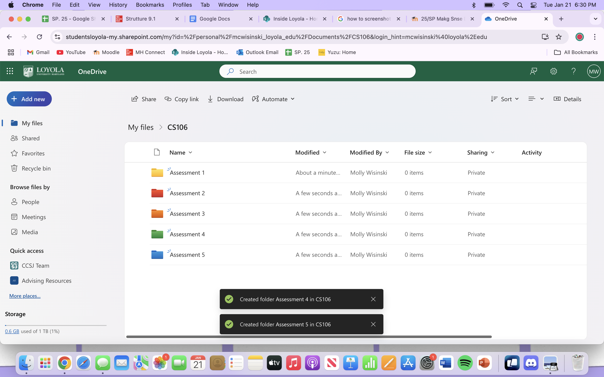

# Liscensed Clinical Social Worker

### About Me 
Hello! I am an experienced college student and childcare professional with over 3 years of proven expertise in sociology and family (child) development. 

With skills in organization, communication, empathy, and leadership I am able to complete assignments, communicate with professors, and maintain an internship. I am adept at using Outlook’s OneDrive, Excel, and SPSS. 

My invaluable skill set, commitment to quality work, and passion for social justice make me a valuable asset.  In my spare time, I like to read historical fiction and go for outdoor walks. 

You can find me on [LinkedIn](https://www.linkedin.com/in/molly-wisinski-485707361) and Instagram.

### Education 
BSc in [Major]
Loyola University, MD

### Projects

#### Email and Calendar
 - image
Tools: OneDrive/Outlook
Challenges: Learning new software because I had only used Google and Gmail previously.
Result/Summary: I entered my weekly schedule, so others can view when I am available. Doing so made me more familiar with the Outlook platform, and therefore helped me be more equipped to operate the system in my professional life.

***
#### Onedrive and Folders
 
Tools: OneDrive
Challenges: New concepts. Never created folders before in Google or Microsoft. 
Result/Summary: I created five faux folders in order to organize my files. Learning how to do this is a skill I will be able to apply to my future career, so I can keep my computer very organized. I will not lose important files, or any files for that matter. 

***
#### Inventory Manager/Charts in Excel

Tools: Excel
Challenges: Learning new skills within Excel and navigating the frustrations that came along with it.
Result/Summary: For this project I used a set of data I had previously entered into Excel, and I created a graph to appropriately analyze the profit margin. Learning to make appropriate graphs will be one of the most useful skills I will have learned seeing as I am going into the social science field, which is based on data, evidence, and statistics. 

